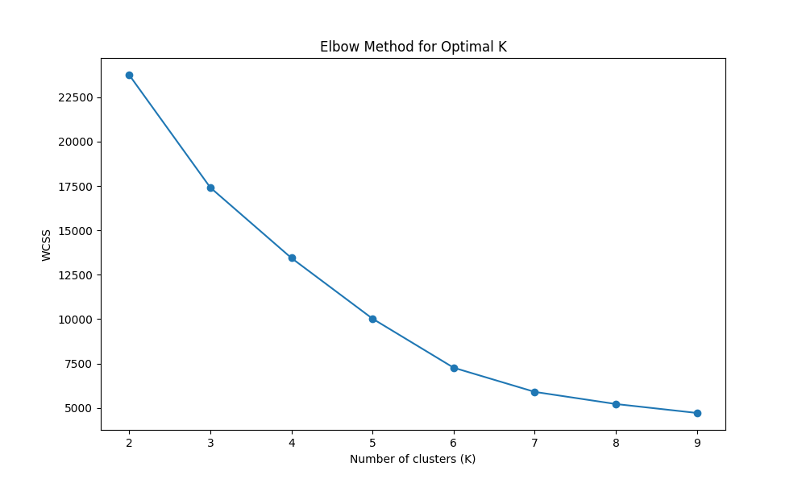

# 데이터 전처리

### 사용한 feature
- 수치형 : `age`, `size`, `bmi`
- 범주형 : `fit`, `body type`  

### 단위 수정
- `height` : feet/inch → cm 변환
- `weight` : lbs → kg 변환  

### 결측치 처리
- `height_cm`, `rating_5`, `age`, `weight_kg`, `size` : 평균값으로 대체
- 범주형(`fit`, `body type`) : 최빈값으로 대체  

### 파생 변수
- `bmi` : `height_cm`와 `weight_kg`로부터 계산 (`weight_kg / (height_cm / 100)^2`)

> `height`와 `weight`는 서로 약한 양의 상관관계(0.35)를 가지고 있으며,  
> 두 변수의 조합은 사용자의 전반적인 체형을 설명하는데 더 효과적인 정보를 제공할 수 있다고 판단.  
> 실제로 `bmi` 추가하고, `weight`, `height` 제거하면 `실루엣 점수` 향상  

- `rating_5` : 1~5점 정규화 평점  

### 클러스터링에 사용된 feature 처리

| Feature Type | 컬럼명             | 처리 방식            |
|--------------|--------------------|----------------------|
| 수치형       | `bmi`, `size`, `age` | MinMaxScaler 적용     |
| 범주형       | `fit`, `body type`  | OneHotEncoder + 가중치 조정 |  

> **가중치 조정 이유**:  
> 원핫 인코딩된 범주형 컬럼이 거리 계산에서 과도하게 영향력을 가지는 문제를 해결하기 위해,  
> `(원핫 인코딩 후 생성된 feature 수) / (전체 feature 수)` 형태로 가중치 적용하여,  
>  전체 거리 계산에서 보다 균형 있게 기여할 수 있도록 조정

***

# Elbow Method 결과 시각화

  

- `k=3~4`는 클러스터 수가 적고 WCSS는 빠르게 감소하지만, 실제 군집이 겹쳐 있을 수 있음.  
`k=7`은 내부 응집도와 외부 분리도가 균형을 이뤄 **더 "선명한 군집 구조"** 를 보여줄 수 있음

***  

# 클러스터별 고객 특성 요약표

| 클러스터 | 평균 BMI | 평균 Size | 평균 Age | Fit (fit/large/small) | 주요 체형 (body type) |
|----------|----------|-----------|----------|------------------------|------------------------|
| 0        | 25.65    | 21.22     | 36.63    | 0.16 / 0.03 / 0.04     | **Apple** (54%)        |
| 1        | 24.26    | 17.88     | 35.02    | 0.17 / 0.03 / 0.03     | **Full Bust** (54%)    |
| 2        | 21.98    | 10.68     | 33.72    | 0.17 / 0.03 / 0.03     | **Athletic** (54%)     |
| 3        | 23.46    | 14.04     | 33.77    | 0.17 / 0.03 / 0.03     | **Pear** (54%)         |
| 4        | 23.28    | 14.05     | 33.87    | 0.17 / 0.03 / 0.03     | **Hourglass** (54%)    |
| 5        | 21.38    | 5.54      | 33.20    | 0.17 / 0.03 / 0.03     | **Petite** (54%)       |
| 6        | 19.94    | 7.28      | 33.36    | 0.17 / 0.03 / 0.03     | **Straight & Narrow** (54%) |  

> 각 `cluster`는 고객의 평균 `bmi`, `size`, `age`와 `body type`에 따라 구분  
>  `Fit` 항목은 클러스터 내에서 해당 `fit` 유형을 선택한 비율을 의미하며,  
> `body type`은 각 클러스터에서 가장 많은 비중을 차지한 체형을 강조해 표시하였습니다.  
> 이러한 클러스터링 결과는 **"고객 체형에 따라 맞춤형 상품 추천"** 에 활용가능합니다.

